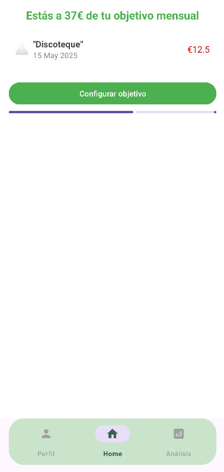
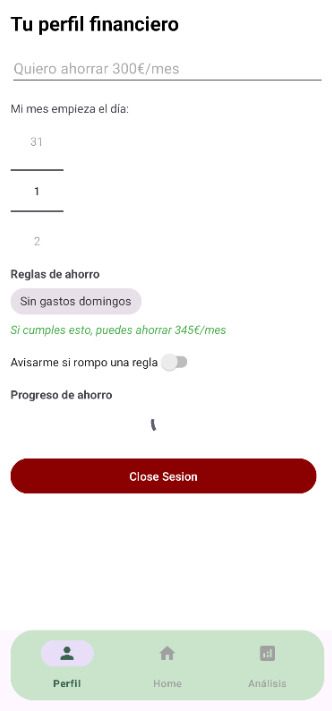
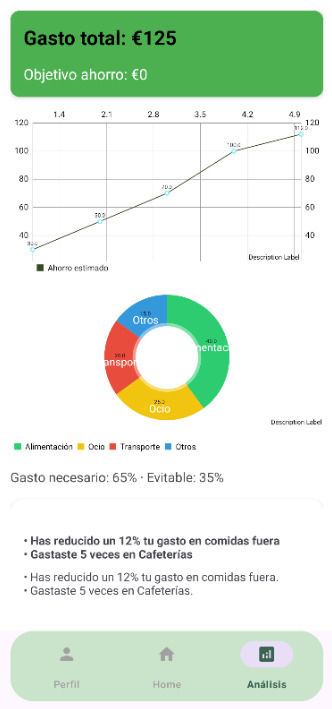

# 🎈 CoinFin

**“Turn single coffees into trips – without earning more, just spending better.”**

CoinFin is a minimalist, emotionally engaging finance app designed to help young adults improve their financial habits without needing to increase their income. The app empowers users to define small, realistic saving rules, track avoidable expenses, and visualize progress through meaningful, visual feedback.

---

## 📱 Overview

CoinFin was born from a simple but powerful idea: make saving feel easy, visual, and motivating — not like punishment. It combines the psychology of micro-achievements with a clean user experience and Firebase integration.

Users define their **own savings goals**, set **custom rules** (e.g. no spending on Sundays), and receive **visual analytics** on their progress. CoinFin is not a banking app; it’s a financial companion.

---

## 🔧 Features

### ✅ Core Functionality
- **Secure Sign Up / Login** using Firebase Authentication
- **Manual expense tracking** with category, type, and notes
- **Custom rules** for avoidable expenses (e.g. "no food delivery more than twice/week")
- **Monthly savings goals** with a visual progress bar
- **Push alerts** if user-defined rules are broken

### 📊 Analytics
- **Line chart** of savings progression
- **Pie chart** of spending breakdown by category
- **Calculation of avoidable vs. necessary expenses**
- **Real-time projection**: “If you follow your rules, you can save €XXX/month”

### 🌱 UX Principles
- Minimal friction: Simple onboarding and UI
- Positive reinforcement: No punishments, only progress
- Emotional connection: Friendly tone, emoji indicators, gamified copy
- Data privacy first: No sensitive financial data stored externally

---

## 🧱 Architecture

- **Pattern:** MVVM (Model-View-ViewModel)
- **Backend:** Firebase (Auth, Firestore)
- **Database Structure:**
  - `/users/{uid}/expenses`
  - `/users/{uid}/goals`
- **Frontend:** Android (Kotlin)
- **Project Structure Highlights:**
  - `adapter/`: RecyclerView adapters
  - `data/models/`: Data classes (e.g. `Gasto`, `Objetivo`)
  - `repository/`: Firebase access logic
  - `ui/`: Fragments for Home, Profile, Analytics, Auth
  - `utils/`: Date formatter, Auth helpers, Firestore manager

---

## 🚀 Screenshots

| Onboarding & Login | Dashboard | Profile | Analytics |
|--------------------|-----------|---------|-----------|
|  |  |  |  |

---

## 🧠 Personas & UX Focus

CoinFin was built around real user research and tested personas:

- **Marta (27, freelance designer):** Wants to save €100/month with minimum sacrifice
- **Alex (32, IT analyst):** Seeks predictive tools and visual feedback
- **Sofía (24, marketing intern):** Needs guided savings for beginners

UX decisions were driven by frustration with overcomplicated fintech apps and a preference for **emotional, visual guidance**.

---

## 🛠️ How to Run Locally

1. Clone the repository:
```bash
git clone https://github.com/MarcGuitart/CoinFin.git
cd CoinFin
```

2. Open in Android Studio

3. Configure Firebase:
   - Add your `google-services.json` in the `/app` folder
   - Enable Email/Password authentication in Firebase console

4. Run the app on emulator or device

---

## 📌 Future Roadmap

- 🔮 AI-driven savings predictions
- 💬 Integrated chatbot for financial coaching
- 🏦 Bank account linking (Open Banking)
- 🧠 Weekly goals and advanced rule customization
- 📱 iOS and Web App (PWA) version

---

## 🔐 License & Copyright

© 2025 Marc Guitart Frescó  
All rights reserved.

This project is protected by copyright.  
**Unauthorized copying, distribution or commercial use is prohibited.**  
For educational or demo purposes only. Contact for licensing or commercial use.

---

## 🤝 Contact

If you want to collaborate, propose improvements or use CoinFin in your portfolio, feel free to reach out:

**Marc Guitart Frescó**
[LinkedIn](https://www.linkedin.com/in/marc-guitart-fresc%C3%B3-05938b23b/) • [Portfolio](https://github.com/MarcGuitart)
